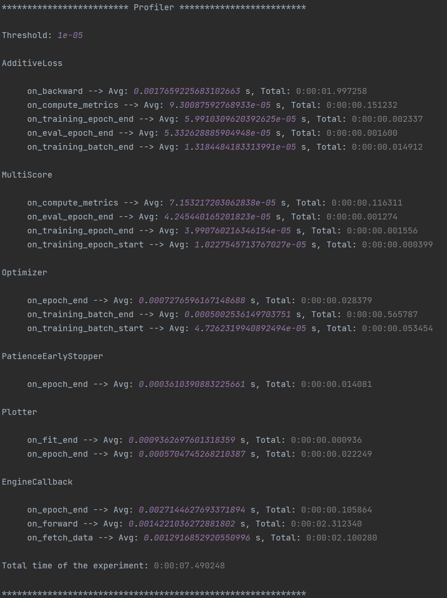

Tutorial
======================
Knowing how to set up valid YAML configuration files is fundamental to properly use **PyDGN**. Custom behavior with
more advanced functionalities can be generally achieved by subclassing the individual modules we provide,
but this is very much dependent on the specific research project.

Data Preprocessing
***********************

The ML pipeline starts with the creation of the dataset and of the data splits. The general template that we can use is
the following, with an explanation of each field as a comment:

.. code-block:: yaml

    splitter:
      root:  # folder where to store the splits
      class_name:  # dotted path to splitter class
      args:
        n_outer_folds:  # number of outer folds for risk assessment
        n_inner_folds:  # number of inner folds for model selection
        seed:
        stratify:  # target stratification: works for graph classification tasks only
        shuffle:  # whether to shuffle the indices prior to splitting
        inner_val_ratio:  # percentage of validation for hold-out model selection. this will be ignored when the number of inner folds is > than 1
        outer_val_ratio:  # percentage of validation data to extract for risk assessment final runs
        test_ratio:  # percentage of test to extract for hold-out risk assessment. this will be ignored when the number of outer folds is > than 1
    dataset:
      root:  # path to data root folder
      class_name:  # dotted path to dataset class
      args:  # arguments to pass to the dataset class
        arg_name1:
        arg_namen:
      transform: # on the fly transforms: useful for social datasets with no node features (with an example)
        - class_name: pydgn.data.transform.ConstantIfEmpty
          args:
            value: 1
      # pre_transform:  # transform data and store it at dataset creation time
      # pre_filter:  # filter data and store it at dataset creation time

Data Splitting
-------------------

We provide a general :class:`~pydgn.data.splitter.Splitter` class that is able to split a dataset of multiple graphs. The most important parameters
are arguably ``n_outer_folds`` and ``n_inner_folds``, which represent the way in which we want to perform **risk assessment**
and **model selection**. For instance:

 * ``n_outer_folds=10`` and ``n_inner_folds=1``: 10-fold external Cross Validation (CV) on test data, with hold-out model selection inside each of the 10 folds,
 * ``n_outer_folds=5`` and ``n_inner_folds=3``: Nested CV,
 * ``n_outer_folds=1`` and ``n_inner_folds=1``: Simple Hold-out model assessment and selection, or ``train/val/test`` split.

We assume that the difference between **risk assessment** and **model selection** is clear to the reader.
If not, please refer to `Samy Bengio's lecture (Part 3) <https://bengio.abracadoudou.com/lectures/theory.pdf>`_.

Here's an snippet of a potential configuration file that splits a graph classification dataset:

.. code-block:: yaml

    splitter:
      root: examples/DATA_SPLITS/CHEMICAL
      class_name: pydgn.data.splitter.Splitter
      args:
        n_outer_folds: 10
        n_inner_folds: 1
        seed: 42
        stratify: True
        shuffle: True
        inner_val_ratio: 0.1
        outer_val_ratio: 0.1
        test_ratio: 0.1

Dataset Creation
-------------------

To create your own dataset, you should implement the :class:`~pydgn.data.dataset.DatasetInterface` interface. For
instance, we provide a wrapper around the `TUDataset <https://pytorch-geometric.readthedocs.io/en/latest/modules/datasets.html#torch_geometric.datasets.TUDataset>`_
dataset of Pytorch Geometric in :class:`~pydgn.data.dataset.TUDatasetInterface`, which you can check to get an idea.

Here's an snippet of a potential configuration file that downloads and processes the ``PROTEINS`` graph classification dataset:

.. code-block:: yaml

    dataset:
      root: DATA/
      class_name: pydgn.data.dataset.TUDataset
      args:
        root: DATA/
        name: PROTEINS

You can also apply ``transform``, ``pre_transform`` and ``pre_filter`` that follow the same semantic of PyG.

Once our data configuration file is ready, we can create the dataset using (for the example above)

.. code-block:: bash

    pydgn-dataset --config-file examples/DATA_CONFIGS/config_PROTEINS.yml

Experiment Setup
**********************

Once we have created a dataset and its data splits, it is time to implement our model and define a suitable task.
Every model must implement the :class:`~pydgn.model.interface.ModelInterface` interface, and it can optionally use a
readout module that must implement the :class:`~pydgn.model.interface.ReadoutInterface`.

At this point, it is time to define the experiment. The general template that we can use is the following, with an
explanation of each field as a comment:

.. code-block:: yaml

    # Dataset and Splits
    data_root:  # path to DATA root folder (same as in data config file)
    dataset_class:  # dotted path to dataset class
    dataset_name:  # dataset name (same as in data config file)
    data_splits_file:  # path to data splits file

    # Hardware
    device:  # cpu | cuda
    max_cpus:  # > 1 for parallelism
    max_gpus: # > 0 for gpu usage (device must be cuda though)
    gpus_per_task:  # percentage of gpus to allocate for each task
    gpus_subset: # optional, comma-separated list of gpu indices, e.g. 0,2. Used to force a particular subset of GPUs being used.

    # Data Loading
    dataset_getter:  # dotted path to dataset provider class
    data_loader:
      class_name:  # dotted path to data loader class
      args:
        num_workers :
        pin_memory:
        # possibly other arguments (we set `worker_init_fn`, `sampler` and `shuffle`, so do not override)

    # Reproducibility
    seed: 42

    # Experiment
    result_folder:  # path of the folder where to store results
    exp_name:  # name of the experiment
    experiment:  # dotted path to experiment class
    higher_results_are_better:  # model selection: should we select based on max (True) or min (False) main score?
    evaluate_every:  # evaluate on train/val/test every `n` epochs and log results
    final_training_runs:  # how many final (model assessment) training runs to perform to mitigate bad initializations

    # Grid Search
    # if only 1 configuration is selected, any inner model selection will be skipped
    grid:
      supervised_config:
        model:  # dotted path to model class
        checkpoint:  # whether to keep a checkpoint of the last epoch to resume training
        shuffle:  # whether to shuffle the data
        batch_size:  # batch size
        epochs:  # number of maximum training epochs

        # Model specific arguments #

        # TBD

        # ------------------------ #

        # Optimizer (with an example - 3 possible alternatives)
        optimizer:
          - class_name: pydgn.training.callback.optimizer.Optimizer
            args:
              optimizer_class_name: torch.optim.Adam
              lr:
                - 0.01
                - 0.001
              weight_decay: 0.
          - class_name: pydgn.training.callback.optimizer.Optimizer
            args:
              optimizer_class_name: torch.optim.Adagrad
              lr:
                - 0.1
              weight_decay: 0.

        # Scheduler (optional)
        scheduler: null

        # Loss metric (with an example of Additive Loss)
        loss:
          - class_name: pydgn.training.callback.metric.AdditiveLoss
            args:
              loss_1: pydgn.training.callback.metric.MulticlassClassification
              loss_2: pydgn.training.callback.metric.MulticlassClassification

        # Score metric (with an example of Multi Score)
        scorer:
          - class_name: pydgn.training.callback.metric.MultiScore
            args:
              main_scorer: pydgn.training.callback.metric.MulticlassAccuracy
              my_second_metric: pydgn.training.callback.metric.ToyMetric

        # Readout (optional)
        readout:

        # Training engine
        engine: pydgn.training.engine.TrainingEngine

        # Gradient clipper (optional)
        gradient_clipper: null

        # Early stopper (optional, with an example of "patience" early stopping on the validation score)
        early_stopper:
          - class_name:
              - pydgn.training.callback.early_stopping.PatienceEarlyStopper
            args:
              patience:
                - 5
              # SYNTAX: (train_,validation_)[name_of_the_scorer_or_loss_to_monitor] -> we can use MAIN_LOSS or MAIN_SCORE
              monitor: validation_main_score
              mode: max  # is best the `max` or the `min` value we are monitoring?
              checkpoint: True  # store the best checkpoint

        # Plotter of metrics
        plotter: pydgn.training.callback.plotter.Plotter

Data Information
-----------------

Here we can specify some information about the dataset:

.. code-block:: yaml

    data_root: DATA
    dataset_class: pydgn.data.dataset.TUDatasetInterface
    dataset_name:  PROTEINS
    data_splits_file:  examples/DATA_SPLITS/CHEMICAL/PROTEINS/PROTEINS_outer10_inner1.splits

Hardware
-----------------

Here we can define how many resources to allocate to parallelize different experiments:

.. code-block:: yaml

    # this will run a maximum of 4 experiments to allocate all of the 2 gpus we have.
    # We use some more cpu resources to take into account potential `data loader workers <https://pytorch.org/docs/stable/data.html#multi-process-data-loading>`_.
    device:  cuda
    max_cpus:  8
    max_gpus: 2
    gpus_per_task:  0.5

Data Loading
-----------------

Here we specify which :class:`~pydgn.data.provider.DataProvider` we want to use to load the data associated with the
given splits, and the :class:`DataLoader` that needs to handle such data:

.. code-block:: yaml

    # Data Loading
    dataset_getter: pydgn.data.provider.DataProvider
    data_loader:
      class_name: torch_geometric.loader.DataLoader
      args:
        num_workers : 2
        pin_memory: True  # should be True when device is set to `cuda`

Experiment Details
--------------------

Here we define the experiment details, including the experiment name and type, and the folder where we want to store
our results:

.. code-block:: yaml

    result_folder: RESULTS
    exp_name: supervised_grid_search_toy
    experiment: pydgn.experiment.supervised_task.SupervisedTask
    higher_results_are_better: True
    evaluate_every: 3
    final_training_runs: 3

Grid Search
--------------

Grid search is identified by the keyword ``grid`` after the experimental details. This is the easiest setting, in which
you can define lists associated to an hyper-parameter and all possible combinations will be created. You can even have
nesting of these combinations for maximum flexibility.

There is one config file ``examples/MODEL_CONFIGS/config_SupToyDGN.yml`` that you can check to get a better idea.

Random Search
--------------

Random search, on the other hand, is identified by the keyword ``random`` after the experimental details. One line above
we have to specify the number of random trials, using the keyword ``num_samples``.

We provide different sampling methods:
 * choice --> pick at random from a list of arguments
 * uniform --> pick uniformly from min and max arguments
 * normal --> sample from normal distribution with mean and std
 * randint --> pick at random from min and max
 * loguniform --> pick following the recprocal distribution from log_min, log_max, with a specified base

There is one config file ``examples/MODEL_CONFIGS/config_SupToyDGN_RandomSearch.yml`` that you can check to get a better idea.

Experiment
--------------

Depending on the experiment type, different main keywords are required:

 * :class:`~pydgn.experiment.supervised_task.SupervisedTask` -> ``supervised_config``
 * :class:`~pydgn.experiment.semi_supervised_task.SemiSupervisedTask` -> ``unsupervised_config`` and ``supervised_config``

Note that an **unsupervised** task may be seen as a supervised task with a loss objective that does not depend on the target.
In the **supervised** task, we have the "standard" training procedure. In the **semi-supervised** task, we expect a first
training phase which is unsupervised and that can produce node/graph embeddings. After that, a second, supervised model
is trained on such embeddings, but adjacency information is not preserved in this second stage.

Inside the dictionary associated to the keyword ``[un]supervised_config``, we expect another number of keywords to be
present:

.. code-block:: yaml

    model:  # dotted path to model class
    checkpoint:  # whether to keep a checkpoint of the last epoch to resume training
    shuffle:  # whether to shuffle the data
    batch_size:
    epochs:  # number of maximum training epochs

    # Model specific arguments #

    # ------------------------ #

    optimizer:
    scheduler:  # (can be "null")
    loss:
    scorer:
    readout:   # (can be "null")
    engine:  # training engine
    gradient_clipper:  # (can be "null")
    early_stopper:   # (can be "null")
    plotter:   # (can be "null")

Once our experiment configuration file is ready, we can launch an experiment using (see below for a couple of examples)

.. code-block:: bash

    pydgn-dataset --config-file examples/MODEL_CONFIGS/config_SupToyDGN.yml

or

.. code-block:: bash

    pydgn-dataset --config-file examples/MODEL_CONFIGS/config_SemiSupToyDGN.yml

And we are up and running!

.. image:: _static/exp_gui.png
   :width: 600

To stop the computation, use ``CTRL-C`` to send a ``SIGINT`` signal, and consider using the command ``ray stop`` to stop
all Ray processes. **Warning:** ``ray stop`` stops **all** ray processes you have launched, including those of other
experiments in progress, if any.

Some things to notice: because we have chosen a 10-fold CV for risk assessment with a simple hold-out model selection **for
each** external fold, you can notice in the picture there are ``10*1`` rows with ``Out_*/Inn_*`` written. For each of these,
we have to perform a model selection with ``4`` possible hyper-parameters' configurations (progress shown on the right handside).
In addition, there are also some stats about the time required to complete the experiments.

After the 10 model selection are complete (i.e., one "best" model for each outer/external fold), it is time to re-train
the chosen models on the 10 different train/test splits. Therefore, you can notice ``10`` rows with ``Final run *`` written.
Since we have specified ``final_training_runs: 3`` in our exp. config file, we will mitigate unlucky random initializations
of the chosen models by averaging test results (of a single outer fold) over 3 training runs. The final generalization
performances of the model (a less ambiguous definition would be: the **class of models** you developed) is obtained,
for this specific case, as the average of the 10 test scores across the external folds. Again, if this does not make sense
to you, please consider reading `Samy Bengio's lecture (Part 3) <https://bengio.abracadoudou.com/lectures/theory.pdf>`_.

Inspecting Results
--------------------

According to our configuration file, the results are stored in the ``RESULTS`` folder. The hierarchy of folder is the following:

.. code-block::

    supervised_grid_search_toy_PROTEINS
    |__ MODEL_ASSESSMENT
        |__ assessment_results.json  # contains the risk assessment results (average of the outer fold results)
        |__ OUTER_FOLD_1
        ...
        |__ OUTER_FOLD_5
            |__ outer_results.json  # contains the aggregated results of the three final runs
            |__ final_run_1
            |__ final_run_2
                |__ tensorboard  # tensorboard folder
                |__ experiment.log  # log file with profiling information
                |__ best_checkpoint.pth  # torch dict holding the "best" checkpoint information according to the early stopper used
                |__ last_checkpoint.pth  # torch dict holding the checkpoint information of the last epoch (top ``checkpoint`` keyword set to true)
                |__ run_2_results.torch  # torch dict holding the results of the 2nd final run on the 5th outer fold.
            |__ final_run_3
            |__ MODEL_SELECTION  # files regarding the model selection inside the 5th outer fold
                |__ winner_config.json  # contains the "best model" across the inner folds (in this case just 1 inner fold) for the 5th fold to be used in the final training runs
                |__ config_1
                |__ config_2
                |__ config_3
                    |__ config_results.json  # contains the aggregated results of the K inner model selection folds
                    |__ INNER_FOLD_1  # first (and only in this case) inner model selection fold
                        |__ tensorboard
                        |__ experiment.log  # log file with profiling information
                        |__ best_checkpoint.pth
                        |__ last_checkpoint.pth
                        |__ fold_1_results.torch  # torch dict holding the results of the 1st fold results of the 3rd configuration.
                |__ config_4
        ...
        |__ OUTER_FOLD_10

Profiling Information
-----------------------

Inside each ``experiment.log`` file, you will find training logs and, at the end of each training, the profiler information
with the per-epoch and total time required by each :class:`~pydgn.training.event.handler.EventHandler`, provided the
time spent is non-negligible (threshold specified in the log file).

Here's what it looks like:

Tensorboard
-----------------------

We can use the generic :class:`~pydgn.training.callback.plotter.Plotter` class to easily visualize the training trend with
Tensorboard, using the information in the ``tensorboard`` folder:

.. code-block:: bash

    tensorboard --logdir RESULTS/supervised_grid_search_toy_PROTEINS/MODEL_ASSESSMENT/OUTER_FOLD_1/final_run1/tensorboard/

And we get:

.. image:: _static/tensorboard.png
   :width: 600

Telegram Bot
-----------------------

Once you have a Telegram bot token and chat id, it is super easy to set up automatic reporting of the main results!
Create a file ``telegram_config.yml`` in the main project folder, and set it up like this:

.. code-block:: yaml

    bot_token: [YOUR TOKEN]
    bot_chat_ID: [YOUR CHAT ID]

    log_model_selection: True  # logs the best config for each outer fold (validation score)
    log_final_runs: True  # logs the outcome of the final runs for each outer fold (test score)

Inside your experiment configuration file (see example in ``examples/MODEL_CONFIGS/config_SupToyDGN.yml``), it is sufficient
to specify your telegram configuration file by adding:

.. code-block:: yaml

    # Telegram Bot
    telegram_config_file: telegram_config.yml

And that's all you have to do to start receiving messages when the model selection/final runs for a specific fold end!
You will also receive a message when the experiment terminates with the test score.
