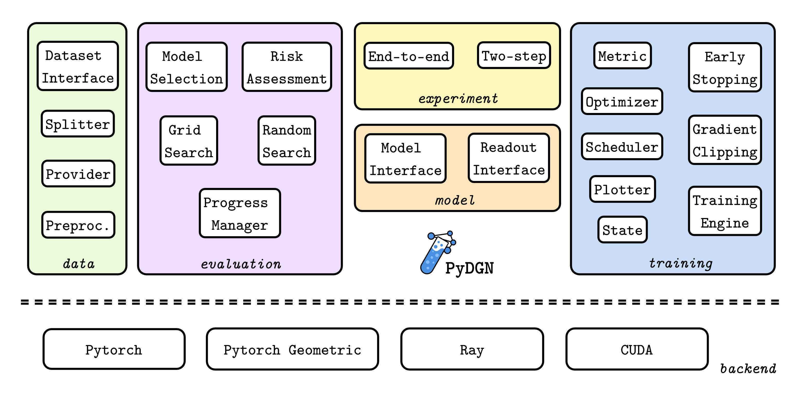

# Summary

The use of standardized evaluation procedures is a key component in the Machine Learning (ML) field to determine whether new approaches grant real advantages over others. This is especially true for fast-growing research areas, where a substantial amount of literature relentlessly appears every day. In the graph machine learning field, some evaluation issues have already been brought to light and partially addressed, but a general-purpose library for rigorous evaluations and reproducible experiments is lacking in the graph machine learning landscape. We therefore introduce a new Python library, called `PyDGN`, to provide users with a system that lets them focus on models' development while ensuring empirical rigor and reproducibility of their results.

# Statement of need

To date, the graph ML community [@1997sperduti_supervised_1997; @2009scarselli_graph_2009; @2009micheli_neural_2009; @2017bronstein_geometric_2017; @2017hamilton_representation_2017; @2020wu_comprehensive_2020] has already developed benchmarking software to re-evaluate existing models on a fixed set of datasets [@2018shchur_pitfalls_2018; @2020errica_fair_2020; @2020hu_open_2020; @2021liu_dig_2021]. In addition, existing libraries such as PyTorch Geometric (PyG) [@2019fey_fast_2019], Deep Graph Library (DGL) [@2019wang_dgl_2019], and Spektral [@2021grattarola_graph_2021] provide the building blocks of Deep Graph Networks (DGNs) [@2020bacciu_gentle_2020], also known as message-passing architectures [@2017gilmer_neural_2017], effectively acting as the backbone of most graph ML software packages. Other libraries, such as GraphGym [@2020_you_design_2020], allow the user to explore the design of existing DGNs by running hyper-parameter tuning experiments in parallel, but the customization is mostly limited to the models and does not allow, for instance, a modular extension of data splitting techniques, evaluation strategies, or experiments with a custom logic. This limits the ability of a researcher to use these libraries to carry out new and possibly original research.  

In other words, the community lacks a software library that is specifically dedicated to ensuring reproducibility and replicability of experiments _without_ compromising the flexibility required by our everyday research. To fill this gap, we have developed `PyDGN`, a Python library for Deep Graph Networks research. `PyDGN` builds upon `PyTorch` [@2019paszke_pytorch_2019] and `PyTorch Geometric` (PyG) [@2019fey_fast_2019] to handle graph-structured data and reuse efficient implementations of machine learning models. It exploits [Ray](https://www.ray.io/) to run experiments in parallel (also on clusters of machines) and it supports [GPU](https://developer.nvidia.com/cuda-toolkit) computation for faster executions. Our goal is to help practitioners and researchers to focus on the development of their models and to effortlessly evaluate them under fair, robust, and reproducible experimental conditions, thus mitigating empirical malpractices that often occur in the ML community [@2018lipton_troubling_2018; @2018shchur_pitfalls_2018; @2020errica_fair_2020]. `PyDGN` has already been used in a number of research projects that have been published at top-tier venues, as listed in the [official GitHub repository](https://github.com/diningphil/PyDGN).

{ width=100% }

We refer the reader to \autoref{fig:pydgn-structure} for a visual depiction of the main components. We remark that all modules, with the exception of the one responsible for evaluation (due to its standard behavior), are readily extensible and promote rapid prototyping through code reuse.

## How to use it
Users can easily prepare and launch their evaluations through *configuration files*, one for the data preparation and the second for the actual experiment. In the former, the user specifies: **i)** how to split the data; **ii)** the dataset to use; and **iii)** optional data transformations. In the second file, the user indicates: **i)** data and splits; **ii)** hardware devices and parallelism; **iii)** hyper-parameter configurations for model selection; **iv)** training-specific details like metrics and optimizer. Dedicated scripts prepare the data, its splits, launch the experiments and compute results. The [PyDGN documentation](https://pydgn.readthedocs.io/) helps the user understand the main mechanisms through tutorials and examples.

### Data preparation
A recurrent issue in the evaluation of ML models is that they are compared using different data splits. The first step to reproducibility is thus the creation and retention of such splits: we provide code that partitions the data depending on the required graph/node/link prediction scenarios. Since splitting depends on the type of evaluation procedure, we cover \textit{hold-out}, \textit{k-fold}, and \textit{nested/double} \textit{k-fold} cross validation, which are the most common evaluation schemas in the ML literature. 

To create and use a dataset, we provide an interface to easily specify pre-processing as well as runtime processing of graphs; we extend the available dataset classes in `PyG` to achieve this goal. In addition, a data provider automatically retrieves the correct data subset (training/validation/test) during an experiment, making sure the user does not involuntarily leak test data into training/validation. An example on how to split a dataset to carry out a 10-fold cross validation with inner hold-out model selection is shown below:

```yaml
splitter:
  root: DATA_SPLITS
  class_name: pydgn.data.splitter.Splitter
  args:
    n_outer_folds: 10
    n_inner_folds: 1
    seed: 42
    stratify: True
    shuffle: True
    inner_val_ratio: 0.1
    outer_val_ratio: 0.1
    test_ratio: 0.1
```

### Evaluation procedures
`PyDGN` is equipped with routines that remove the burden of performing model selection and risk assessment from the users. This reduces chances of empirical flaws and favors reproducible experiments. After model selection, the best configuration (with respect to the validation set) is re-trained and evaluated on the test set. In addition, a start-and-stop mechanism can resume execution of unfinished experiments when the whole evaluation is interrupted. These procedures are completely transparent to the user and handled in accordance to the data splits.

### Experiment templates

We define an abstract interface for each experiment that consists of two methods, _run_valid_ and _run_test_. The first is called during the model selection, and the second is called during risk assessment of the model. This should act as a reminder that the user cannot access the test data when performing a model-selection procedure (that is, _run_valid_), thus reducing the chances of test data leakage. Our library ships with two standard experiments, an end-to-end training on a single task and two-step training where first we compute unsupervised node/graph embeddings and then apply a supervised predictor on top of them to solve a downstream task. These two implementations cover most use cases and ensure that the different data splits are used in the correct way.

### Implementing models
To implement a DGN in our library, it is sufficient to adhere to a very simple interface that specifies initialization arguments and the type of output for the prediction step. The user wraps the interface around a `PyG` model to have it immediately working. This strategy allows the user to focus entirely on the development of the model regardless of all the code necessary to run the training pipeline, akin to what happens in [@2020_you_design_2020]. The library will automatically provide the current hyper-parameter configuration to be evaluated to the model in the form of a dictionary `config`. To create a new model, the user simply has to subclass `ModuleInterface` and implement the two methods

```python
class MyModel(pydgn.model.interface.ModelInterface):
    def __init__(self,
                 dim_node_features, dim_edge_features, dim_target,
                 readout_class, config: dict):
        ...

    def forward(self, data):
        ...
```

where `data` is a PyG `Batch` object containing a batch of input graphs.

### Training via publish-subscribe
The interaction between all components of a training pipeline is perhaps the trickiest part to implement in any machine learning project. One false step, and nothing works. PyDGN's training engine implements all boilerplate code regarding the training loop, and it relies on the publish-subscribe design pattern to trigger the execution of callbacks at specific points in the training procedure. Every metric, early stopping, scheduler, gradient clipper, optimizer, data fetcher, and stats plotter implements some of these callbacks; when a callback is triggered, a shared state object is passed as argument to allow communication between the different components of the training process. For instance, extending the MeanSquaredError loss to compute its logarithm is as easy as doing
```python
class LogMSE(pydgn.training.callback.metric.MeanSquareError):
 
    @property
    def name(self):
        return "LOG Mean Square Error"

    def compute_metric(self, targets, predictions):
        mse_metric = super().compute_metric(targets, predictions)
        return torch.log(mse_metric)
```

The new metric can be already referenced and used in the configuration file by referrint it as `my_metric_file.LogMeanSquareError`. It will also be automatically logged on Tensorboard by the `Plotter` callback if the latter is enabled.

## Key Design Considerations

Two important aspects make PyDGN a user-friendly choice for everyday research.

First, PyDGN's use of configuration files allows users to add new hyper-parameters without needing to modify any extra code. This feature simplifies the customization of a model while prototyping it to keep the user focused on the main task, that is, the definition and implementation of a model, ignoring all the boilerplate code used to forward the new hyper-parameters to the model's class initializer.

Additionally, the publish-subcribe design pattern keeps the codebase organized and flexible. Users can connect different components as needed using a shared state object, making it adaptable to various use cases. Most of the time, refining a training loop only requires subclassing the desired callbacks, simplifying the overall development process.

In summary, PyDGN's configuration files and event-based design pattern enhance its usability, making it a practical tool for researchers by simplifying customization and maintaining code flexibility. These features empower researchers to efficiently achieve their research goals.


# Acknowledgements

We acknowledge contributions from Antonio Carta, Danilo Numeroso, Daniele Castellana, Alessio Gravina, Francesco Landolfi, and support from Marco Podda during the genesis of this project. 

# References
